# AdaIN-style
This repository contains the code (in [Torch](http://torch.ch/)) for the paper:

[**Arbitrary Style Transfer in Real-time with Adaptive Instance Normalization**](https://arxiv.org/abs/1703.06868)
<br>
[Xun Huang](http://www.cs.cornell.edu/~xhuang/),
[Serge Belongie](http://blogs.cornell.edu/techfaculty/serge-belongie/)
<br>
ICCV 2017 (**Oral**)

This paper proposes the first real-time style transfer algorithm that can transfer *arbitrary* new styles, in contrast to [a single style](https://arxiv.org/abs/1603.03417) or [32 styles](https://arxiv.org/abs/1610.07629). Our algorithm runs at 15 FPS with 512x512 images on a Pascal Titan X. This is around 720x speedup compared with the [original algorithm](https://arxiv.org/abs/1508.06576) of Gatys et al., without sacrificing any flexibility. We accomplish this with a novel *adaptive instance normalization* (AdaIN) layer, which is similar to [instance normalization](https://arxiv.org/abs/1701.02096) but with affine parameters adaptively computed from the feature representations of an arbitrary style image.
<p align='center'>
  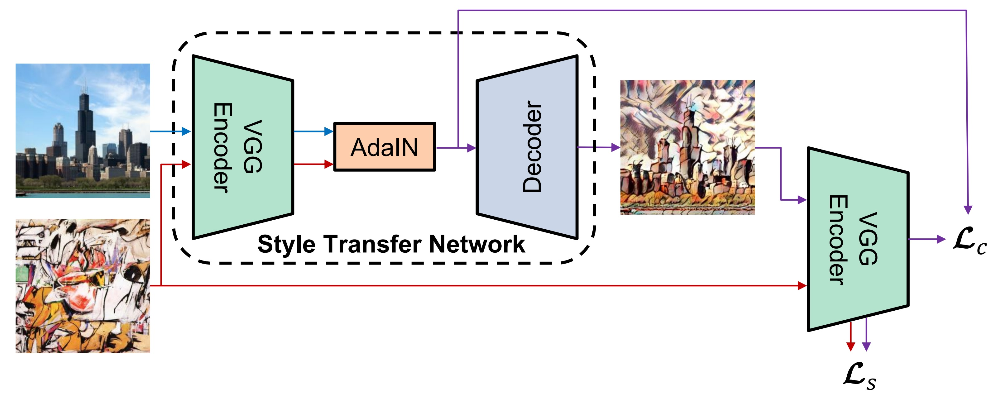
</p>

## Examples
<p align='center'>
  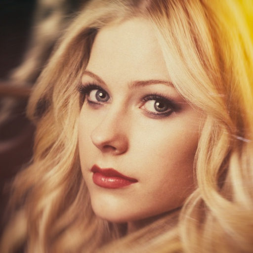
  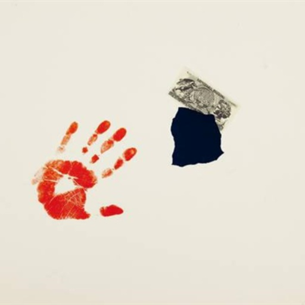
  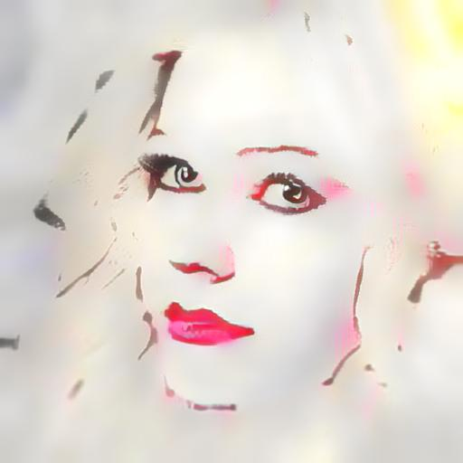
  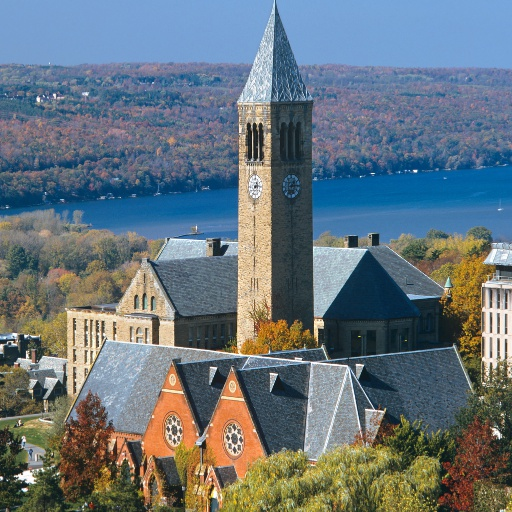
  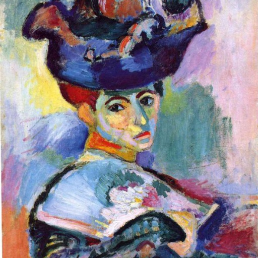
  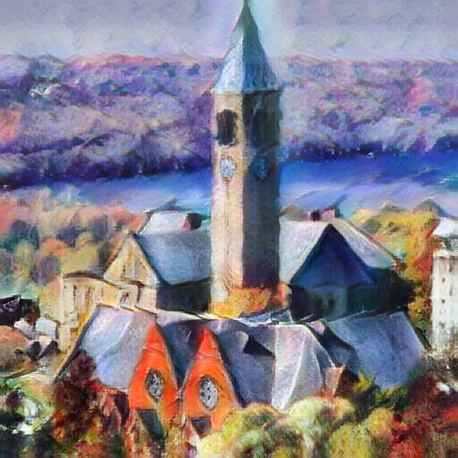
</p>

<p align='center'>
  
  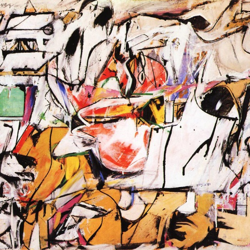
  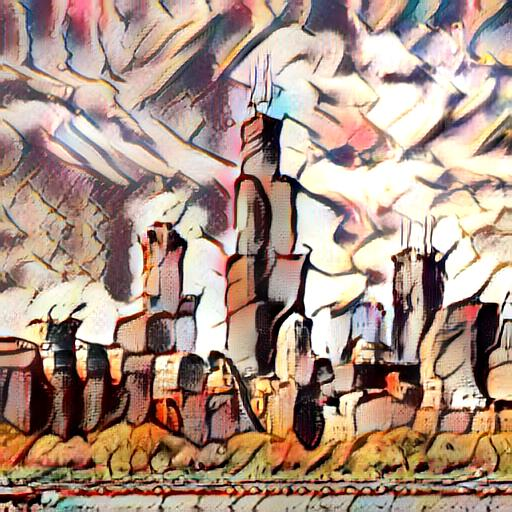
  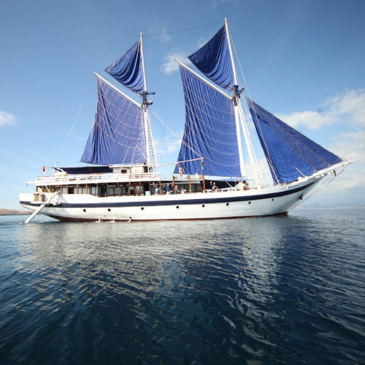
  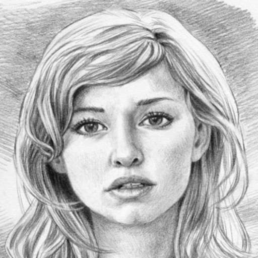
  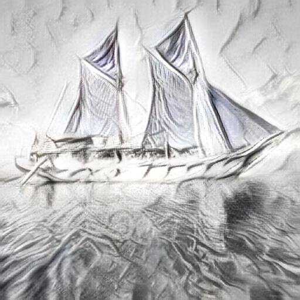
</p>

<p align='center'>
  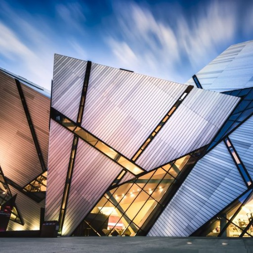
  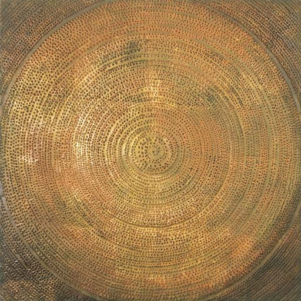
  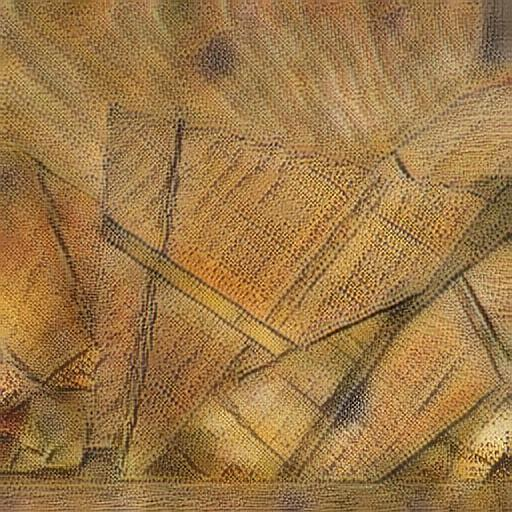
  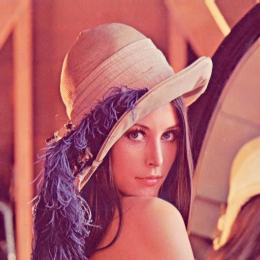
  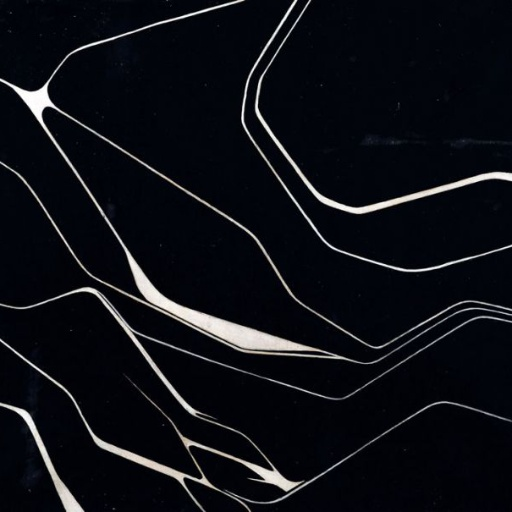
  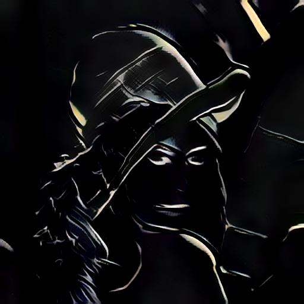
</p>

## Dependencies
* [torch7](https://github.com/torch/torch7)

Optionally:
* CUDA and cuDNN
* [cunn](https://github.com/torch/cunn)
* [torch.cudnn](https://github.com/soumith/cudnn.torch)
* [ffmpeg](https://ffmpeg.org/) (for video)


## Download
```
bash models/download_models.sh
```

This command will download a pre-trained decoder as well as a modified VGG-19 network. Our style transfer network consists of the first few layers of VGG, an AdaIN layer, and the provided decoder.

## Usage
### Basic usage
Use `-content` and `-style` to provide the respective path to the content and style image, for example:
```
th test.lua -content input/content/cornell.jpg -style input/style/woman_with_hat_matisse.jpg
```

You can also run the code on directories of content and style images using `-contentDir` and `-styleDir`. It will save every possible combination of content and styles to the output directory.

```
th test.lua -contentDir input/content -styleDir input/style
```
Some other options:
* `-crop`: Center crop both content and style images beforehand.
* `-contentSize`: New (minimum) size for the content image. Keeping the original size if set to 0.
* `-styleSize`: New (minimum) size for the content image. Keeping the original size if set to 0.

To see all available options, type:
```
th test.lua -help
```

### Content-style trade-off
Use `-alpha` to adjust the degree of stylization. It should be a value between 0 and 1 (default). Example usage:
```
th test.lua -content input/content/chicago.jpg -style input/style/asheville.jpg -alpha 0.5 -crop
```

By changing `-alpha`, you should be able to reproduce the following results.

<p align='center'>
  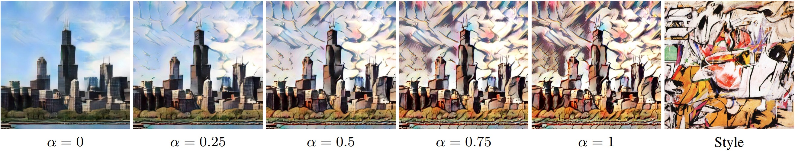
</p>

### Transfer style but not color
Add `-preserveColor` to preserve the color of the content image. Example usage: 
```
th test.lua -content input/content/newyork.jpg -style input/style/brushstrokes.jpg -contentSize 0 -styleSize 0 -preserveColor
```

<p align='center'>
  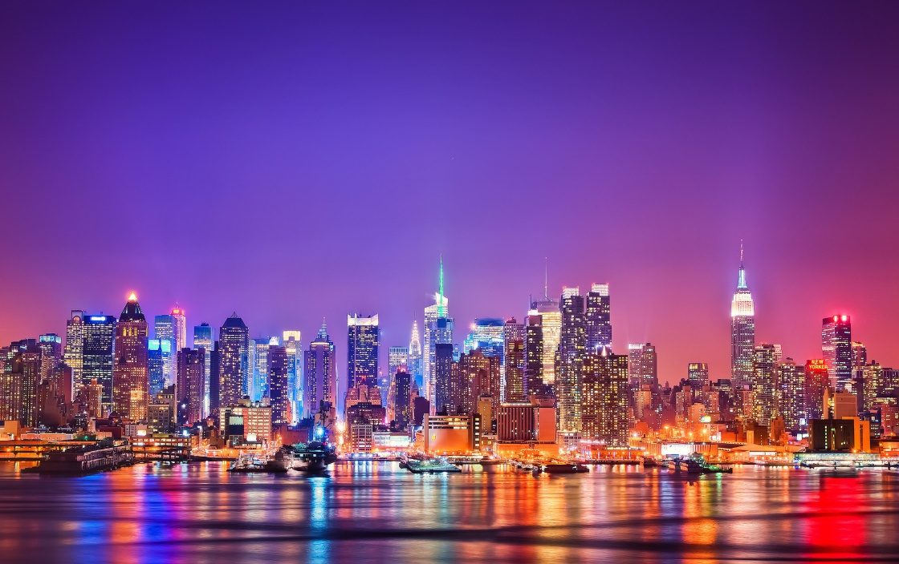
  
</p>
<p align='center'>
  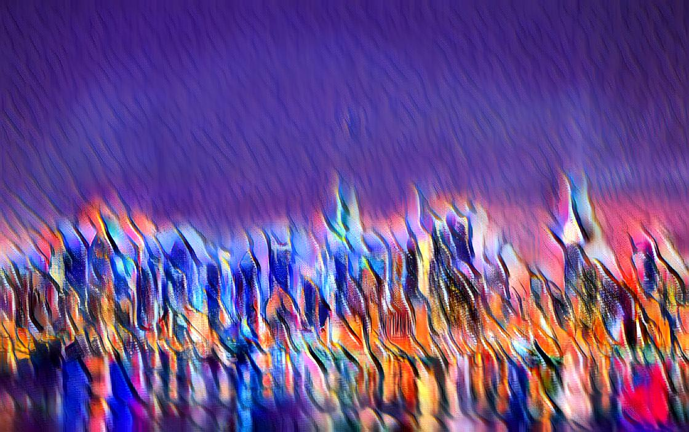
</p>

### Style interpolation
It is possible to interpolate between several styles using `-styleInterpWeights ` that controls the relative weight of each style. Note that you also to need to provide the same number of style images separated be commas. Example usage:
```
th test.lua -content input/content/avril.jpg \
-style input/style/picasso_self_portrait.jpg,input/style/impronte_d_artista.jpg,input/style/trial.jpg,input/style/antimonocromatismo.jpg \
-styleInterpWeights 1,1,1,1 -crop
```
You should be able to reproduce the following results shown in our paper by changing `-styleInterpWeights `.

<p align='center'>
  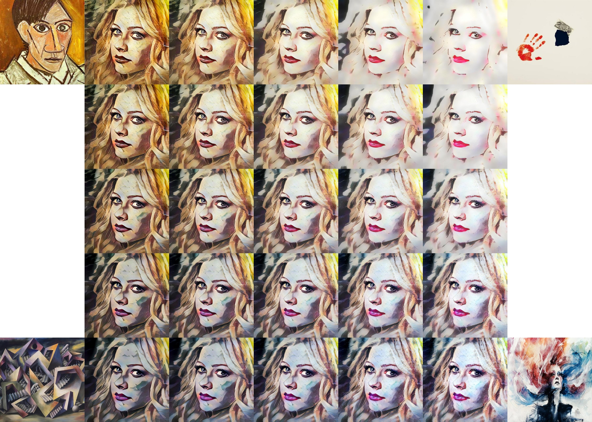
</p>

### Spatial control
Use `-mask` to provide the path to a binary foreground mask. You can transfer the foreground and background of the content image to different styles. Note that you also to need to provide two style images separated be comma, in which the first one is applied to foreground and the second one is applied to background. Example usage:
```
th test.lua -content input/content/blonde_girl.jpg -style input/style/woman_in_peasant_dress_cropped.jpg,input/style/mondrian_cropped.jpg \
-mask input/mask/mask.png -contentSize 0 -styleSize 0
```

<p align='center'>
  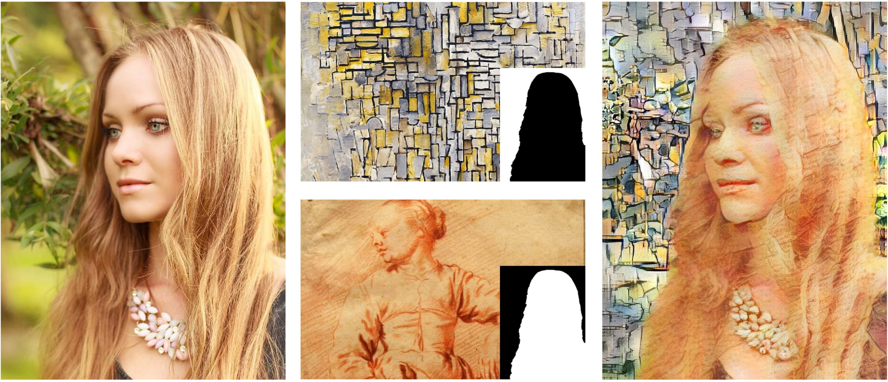
</p>

### Video Stylization
Use `styVid.sh` to process videos, example usage:
```
th testVid.lua -contentDir videoprocessing/${filename} -style ${styleimage} -outputDir videoprocessing/${filename}-${stylename}
```
This generates 1 mp4 for each image present in ```style-dir-path```. Other video formats are also supported. To change other parameters like alpha, edit line 53 of ```styVid.sh```. An example video with some results can be seen [here](https://www.youtube.com/watch?v=vVkufidT0fc&t=1s) on youtube.

## Training

1. Download [MSCOCO images](http://mscoco.org/dataset/#download) and [Wikiart images](https://www.kaggle.com/c/painter-by-numbers).
2. Use `th train.lua -contentDir COCO_TRAIN_DIR -styleDir WIKIART_TRAIN_DIR` to start training with default hyperparameters. Replace `COCO_TRAIN_DIR` with the path to COCO training images and `WIKIART_TRAIN_DIR` with the path to Wikiart training images. The default hyperparameters are the same as the ones used to train `decoder-content-similar.t7`. To reproduce the results from `decoder.t7`, add `-styleWeight 1e-1`.

## Citation

If you find this code useful for your research, please cite the paper:

```
@inproceedings{huang2017adain,
  title={Arbitrary Style Transfer in Real-time with Adaptive Instance Normalization},
  author={Huang, Xun and Belongie, Serge},
  booktitle={ICCV},
  year={2017}
}
```
## Acknowledgement

This project is inspired by many existing style transfer methods and their open-source implementations, including:
* [Image Style Transfer Using Convolutional Neural Networks](http://www.cv-foundation.org/openaccess/content_cvpr_2016/html/Gatys_Image_Style_Transfer_CVPR_2016_paper.html), Gatys et al. [[code](https://github.com/jcjohnson/neural-style) (by [Johnson](http://cs.stanford.edu/people/jcjohns/))]
* [Perceptual Losses for Real-Time Style Transfer and Super-Resolution](https://arxiv.org/abs/1603.08155), [Johnson](http://cs.stanford.edu/people/jcjohns/) et al. [[code](https://github.com/jcjohnson/fast-neural-style)]
* [Improved Texture Networks: Maximizing Quality and Diversity in Feed-forward Stylization and Texture Synthesis](https://arxiv.org/abs/1701.02096), [Ulyanov](https://dmitryulyanov.github.io/about/) et al. [[code](https://github.com/DmitryUlyanov/texture_nets)]
* [A Learned Representation For Artistic Style](https://openreview.net/forum?id=BJO-BuT1g&noteId=BJO-BuT1g), [Dumoulin](http://vdumoulin.github.io/) et al. [[code](https://github.com/tensorflow/magenta/tree/master/magenta/models/image_stylization)]
* [Fast Patch-based Style Transfer of Arbitrary Style](https://arxiv.org/abs/1612.04337), Chen and [Schmidt](http://www.cs.ubc.ca/~schmidtm/) [[code](https://github.com/rtqichen/style-swap)]
* [Controlling Perceptual Factors in Neural Style Transfer](https://arxiv.org/abs/1611.07865), Gatys et al. [[code](https://github.com/leongatys/NeuralImageSynthesis)]

## Contact

If you have any questions or suggestions about the paper, feel free to reach me (xh258@cornell.edu).
